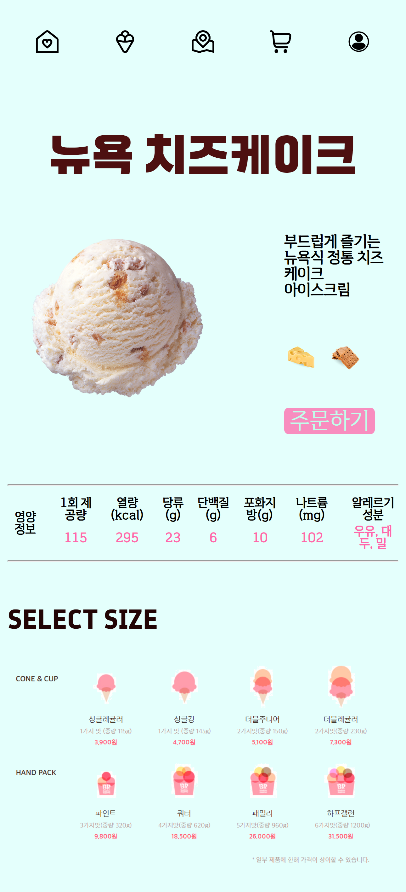
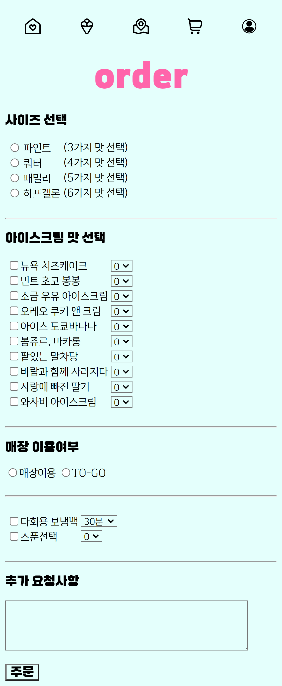

<h1>🍧베라 홈페이지</h1>
HTML_CSS_ICECREAM_STORE
 
<h2><b> 🎥시연영상 </b></h2>
https://play-tv.kakao.com/embed/player/cliplink/446318653?service=daum_tistory
 
<h2 ><b> ⚙️ 개발 환경 </b></h2>

 Front

 - HTML

 - CSS

 
<h2 ><b> 📝주제선정 과정 </b></h2>

 - 주제 선정 당시 아이스크림이 먹고싶어서 아이스크림판매 사이트 프로젝트를 계획하게 됨.

 - 이후 먹고싶은 맛을 고르며 아이스크림 판매사이트를 만들었음.

 
<h2 ><b> 📅개발 일정 </b></h2>

 - 2024.4.12 프로젝트 기획

 - 2024.4.13~14 프로젝트 구현

 - 2024.4.15 프로젝트 발표

 
<h2><b> 🛠️ 구현 기능 & 💻서비스화면 </b></h2>
<h3><b>홈 &amp; 메뉴</b></h3>

테이블을 이용하여 전체적인 구도를 잡음

:hover 를 이용해 마우스가 올라간 맛의 배경색이 변하는 효과를 줌.

이미지 누르면 맛의 상세페이지, 관련페이지(member, 장바구니, 지도)로 이동

 </img>
 
<h3><b>상세 페이지</b></h3>

main과 마찬가지로 테이블을 이용하여 구성함.

주문버튼에 :hover 효과를 줌.

주문버튼 누르면 주문페이지로 이동

&nbsp;

 </img>

<h3><b>주문 페이지</b></h3>

다양한 input 태그 유형 사용

submit 이용해 주문(제출)

 </img>
